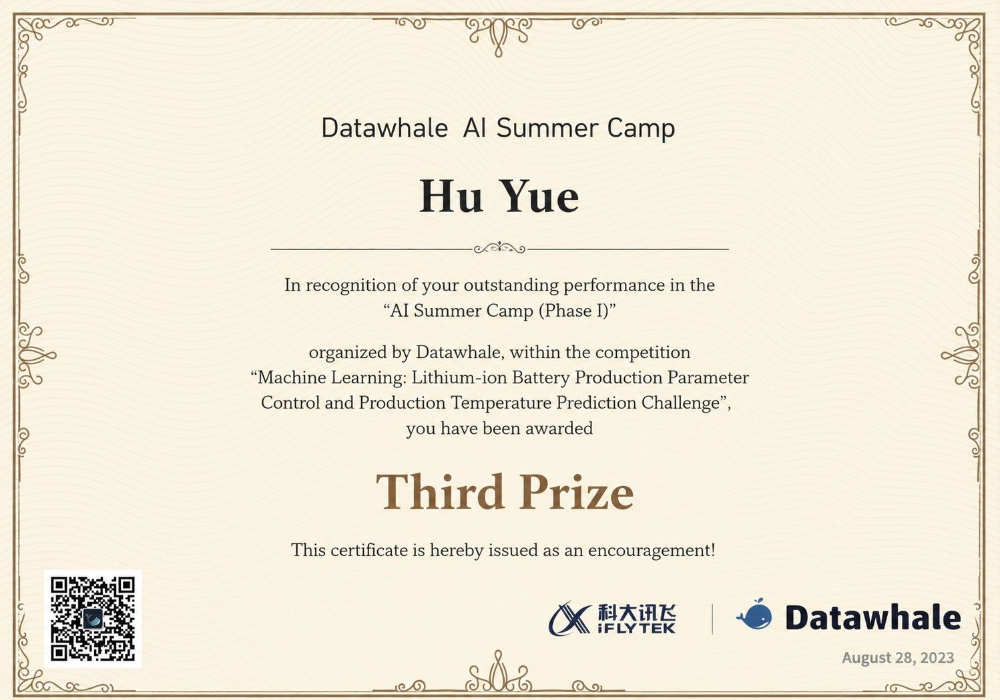

# 🔋 Lithium-Ion Battery Furnace Temperature Prediction

Industrial Furnace Modeling | Time-Series Feature Engineering | Multi-Output Regression

📌 Project Background

Lithium-ion batteries are widely used due to their high energy density, lightweight design, and stable performance. However, during battery production and operation, heat accumulation and high-temperature environments can significantly degrade battery lifespan and consistency.

In industrial battery manufacturing, electric furnaces are core equipment for material sintering. Accurately modeling the furnace temperature field and predicting internal spatial temperatures are critical for:

Improving product consistency

Reducing energy consumption

Enabling optimal process control

This project is based on a real industrial competition dataset (data anonymized), focusing on data-driven modeling of furnace temperature dynamics.

dataset link:https://aistudio.baidu.com/datasetdetail/227148?login_type=weixin

# 🎯 Problem Definition

Given control parameters of an industrial electric furnace:

Upper heating rod set temperatures (17 zones)

Lower heating rod set temperatures (17 zones)

Bottom air inlet flow rates (17 zones)

the task is to predict spatial temperature measurements at:

17 upper furnace temperature points

17 lower furnace temperature points

This is formulated as a multi-output regression problem with Mean Absolute Error (MAE) as the evaluation metric.

# 📊 Dataset Overview

Inputs

Upper heating temperatures: T1-1 ~ T1-17

Lower heating temperatures: T2-1 ~ T2-17

Air inlet flow rates: V1 ~ V17

Timestamp (时间)

Outputs

34 temperature measurements (17 upper + 17 lower)

Data Characteristics

Time-series production data

Strong temporal dependency

High-dimensional control parameters

Data Status

Industrial data with desensitization / anonymization

# 🧠 Modeling Approach
**1. Feature Engineering**

Extensive feature engineering was applied to capture temporal dynamics and physical relationships, including:

Time-Based Features

Month, day, hour, minute

Day of week, day of year, week of year

Weekend indicator

Cross Features (Per Zone)

Flow / upper temperature ratio

Flow / lower temperature ratio

Upper / lower temperature ratio

Temporal Dependency Features

Lag features (t−1)

First-order differences

Rolling window statistics (3-step moving average)

These features help approximate thermal inertia and delayed furnace responses.

**2. Model Selection**

Model: LightGBM (Gradient Boosted Decision Trees)

Objective: Regression

Metric: Mean Absolute Error (MAE)

Strategy:

Train one model per output temperature

Consistent feature set across all outputs

Train / validation split (80 / 20)

LightGBM was chosen for its:

Strong performance on tabular industrial data

Ability to model non-linear interactions

Robustness to feature scale and noise

**3. Training & Evaluation**

Each of the 34 temperature targets was modeled independently

Validation MAE was tracked per output

Final predictions were generated for the test set and formatted for submission

# 📈 Key Results

Successfully modeled upper and lower furnace spatial temperatures

Captured temporal trends and control-response relationships

Achieved stable MAE performance across all temperature zones

Demonstrated the feasibility of data-driven furnace temperature estimation without physical sensors at every point

# 🛠️ Tech Stack

Python

LightGBM

Pandas / NumPy

scikit-learn

Time-series feature engineering

# 🏆 Competition Result

This project was developed for an official industrial data mining competition on lithium-ion battery furnace temperature prediction.  
The solution achieved **Third Prize**, ranked among the top teams.

**Third Prize Certificate**

  

